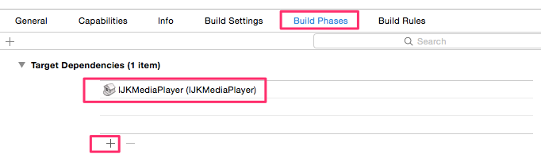
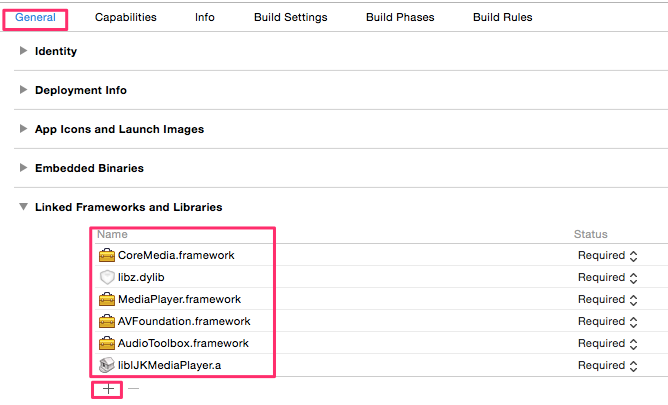

# SRPMoviePlayerController
基於 [ijkplayer](https://github.com/bbcallen/ijkplayer) 的線上影片播放器, 支援 TV out, AirPlay 全螢幕播放.

基本上我是用在我的 App [影音瀏覽器](https://itunes.apple.com/us/app/ying-yin-liu-lan-qi/id923745389?l=zh&ls=1&mt=8) 來播放 flash 影片用的.

>這裡的 AirPlay 是指 User 手動使用內建控制面板切換 AirPlay, 而非在播放器內切換.

## 需求
iOS 8 Later

僅在 iPhone 6 (iOS 8.1.1), iPad 3 (iOS 8.1.1) 測試過 (__盡量使用實體測試__)

>使用 AirPlay 時, 在 iPad 3 上效能很差, 但是透過連接線播放就沒問題.  
>而在 iPhone 6 使用 AirPlay, 效果很好.

## 使用
依照 [ijkplayer](https://github.com/bbcallen/ijkplayer) 下載編譯後, 將 SRPMoviePlayerController 目錄拖放置你的專案.

```Objc
SRPMoviePlayerController *mvc = [[SRPMoviePlayerController alloc]init];

mvc.videoURL = url;

[self presentViewController:mvc animated:YES completion:nil];
```

>不要使用 UINavigationController push, 因為 SRPMoviePlayerController 本身有自帶的 UINavigationBar.

## ijkplayer 設置
下載 ijkplayer 後, 如果你使用 import project 方式, 請按照下列步驟

1. 將 IJKMediaPlayer.xcodeproj 拖至你的專案


2. 在 Build Phases 加入 ijkplayer



3. 加入相關 Frameworks / libraries



如果你使用編譯好的 Libraries, 請加入相關 Frameworks.