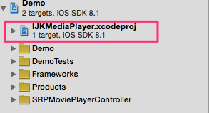

[](LICENSE)
[](https://www.paypal.com/cgi-bin/webscr?cmd=_s-xclick&hosted_button_id=LC58N7VZUST5N)


基於 [ijkplayer k0.4.4.1][1] 的影片播放器, 不帶控制面板.

Online [Demo][2].




# 特色
- 支援外接螢幕.
- 播放格式: 請參考 [ijkplayer][4].
- 播放協定: 請猜考 [ijkplayer][4].


# 安裝
下載已編譯的 [SRPPlayerViewController.framework][5] 和 [IJKMediaFramework.framework][6] (支援 i386, x86_64, armv7, arm64) 並拖入你的 Project.


# 使用
```objC
SRPPlayerViewController *mvc = [[SRPPlayerViewController alloc]init];
mvc.mediaURL = ...
```

或是繼承 SRPPlayerViewController.


[1]: https://github.com/Bilibili/ijkplayer/releases/tag/k0.4.4.1 "k0.4.4.1"
[2]: https://appetize.io/app/kekyum7wkdtpgn0er6kdnwztk0 "Demo"
[3]: README_TW.md
[4]: https://github.com/Bilibili/ijkplayer "ijkplayer"
[5]: https://github.com/shinrenpan/SRPPlayerViewController/releases/download/1.0.1/SRPPlayerViewController.framework.zip "Release"
[6]: https://www.dropbox.com/s/f5s5pggji98p4hi/IJKMediaFramework.framework_k0.4.4.1.zip?dl=0 "IJKMediaFramework"
